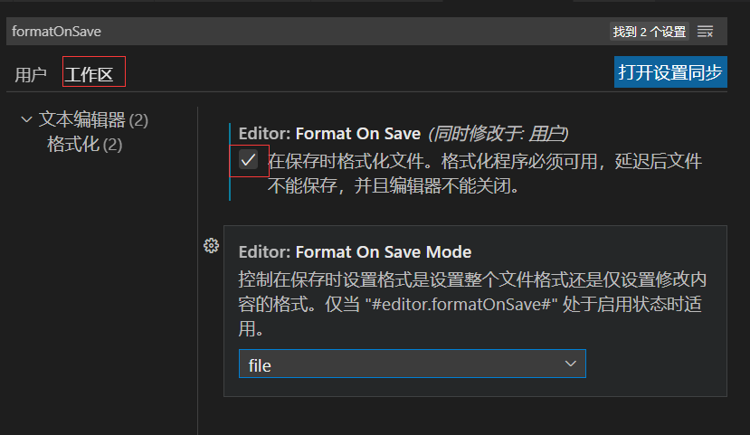
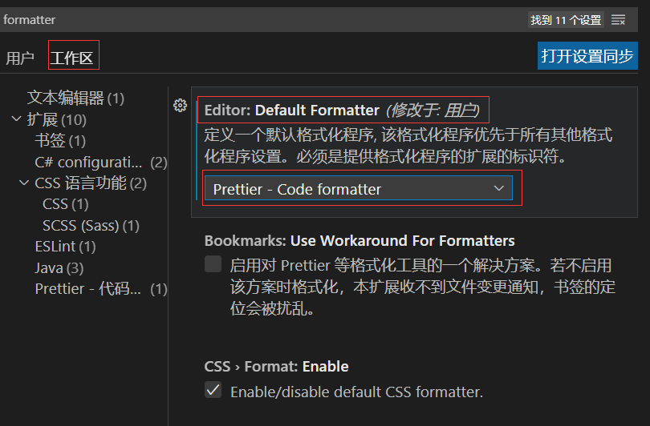

## vue + vite 初始化项目

### 安装 vite

[地址](https://cn.vitejs.dev/guide/#trying-vite-online)

```sh
npm create vite@latest
```

```md
package.json 中，script 中 使用 dev 命令: "vite --open" 加上 --open 自动打开浏览器
```

### vite 环境变量

```md
import.meta.env 有五个环境变量

BASE_URL: 开发或者生产环境服务的公共基础路径
DEV: true: 当前环境是否为开发环境, true 为开发环境
PROD: false: 当前环境是否为生产环境, true 为生产环境
MODE: 应用运行的模式, 分为开发者模式(development), 生产环境模式(production)
SSR: false: 是否为服务器渲染
```

### 自定义环境变量

1. 在根目录新建`.env`, `.env.development`, `.env.production`
2. 在`vite-env.d.ts` 增加 interface ImportMetaEnv

```ts
/// <reference types="vite/client" />

declare module "*.vue" {
  import type { DefineComponent } from "vue";
  const component: DefineComponent<{}, {}, any>;
  export default component;
}

interface ImportMetaEnv {
  VITE_USER_NAME: string;
}
```

### 在 package.json 文件中明确环境变量和生产环境

```json
"script": {
  "dev": "vite --mode development --open",
  "build": "vite build --mode production --open",
  "preview": "vite preview --open",
}
```

### vite.config.ts 开发环境和生产环境配置, 类型解决

1. 安装`dotenv`依赖

dotenv 是一个零依赖的模块，将内存缓存对象上的环境变量列表读取到一个对象中。

**环境配置第一步：** 拼接环境文件名。

vite.config.ts

```ts
export default defineConfig((mode) => {
  const _mode = mode.mode;
  // console.log("_mode", _mode);
  let server: CommonServerOptions = {};

  const envFileName: string = ".env";
  const curEnvFileName = `${envFileName}.${_mode}`;
  const envData = fs.readFileSync(curEnvFileName);
  const envMap: DotenvParseOutput = dotenv.parse(envData);
  if (_mode === "development") {
    console.log("development");
    server = {
      host: envMap.VITE_HOST,
      port: Number(envMap.VITE_PORT),
      proxy: {
        [envMap.VITE_BASE_URL]: {
          target: envMap.VITE_PROXY_DOMAIN,
        },
      },
    };
  } else if (_mode === "production") {
    console.log("production");
  }
  return {
    base: "./",
    plugins: [vue()],
    server,
  };
});
```

### ESLINT 配置

第一步： 安装 ESLint 相关依赖

```js
npm install eslint@7.2.0 eslint-plugin-vue@7.20.0 vue-eslint-parser @typescript-eslint/parser @typescript-eslint/eslint-plugin -D
```

第二步：初始化 ESLint，生成 eslintrc.js 默认规则。

执行 eslint --init 初始化命令。

选择 To check syntax and find problems 。

选择 CommonJS 规范。

选择 Vue.js 框架。

.eslintrc 文件

```json
{
  // eslintrc.js文件所在的目录为root目录，
  //  eslint规则将对这个目录以及该目录下所有文件起作用。
  "root": true,
  // 让vue3.2中的这些全局函数能正常使用。
  "globals": {
    "defineProps": "readonly",
    "defineEmits": "readonly",
    "defineExpose": "readonly",
    "withDefaults": "readonly"
  },
  // eslint 继承别人写好的配置规则，这些规则是检测语法时的规则的来源。
  "extends": ["plugin:@typescript-eslint/recommended"],
  // 插件的作用就是对规则进行补充，
  //如果 typescript-eslint/recommended 里面就没有包含与 vue 相关的规则,
  //那么就让 ESLint 兼容 vue 的语法.
  "plugins": ["vue"],
  "parser": "vue-eslint-parser", //  检测 vue 语法规范 的 eslint 解析器。
  "parserOptions": {
    // 发现尽管 ecmaVersion设置版本为5, 但 ESLint 依然能识别 ES6 的语法
    // 这是  '@typescript-eslint/parser' 解析器帮着识别了。
    "ecmaVersion": 2021,
    "parser": "@typescript-eslint/parser" // 检测 ts 语法规范的 eslint 解析器
  },
  "rules": {
    //  生产环境不允许控制台输出，开发允许允许控制台输出。
    "no-console": "off",
    "space-before-function-paren": 0, // 不允许函数的()前有空格
    "vue/no-multiple-template-root": 0,
    "@typescript-eslint/no-empty-function": 0, //允许出现空的函数
    "@typescript-eslint/no-explicit-any": [0], // 允许使用any
    "@typescript-eslint/no-var-requires": 0, // 项目中允许使用 require()语法。
    "semi": 0, // 关闭语句结尾分号
    "quotes": [2, "single"], //使用单引号
    "prefer-const": 2, // 开启不变的变量一定要使用const
    "@typescript-eslint/no-unused-vars": 0, // 允许出现未使用过的变量
    "@typescript-eslint/no-inferrable-types": 0, //  允许变量后面添加类型
    "@typescript-eslint/no-non-null-assertion": 0
  }
}
```

package.json 文件, 配置 ESLint 验证的哪些类型的文件

```js
"lint": "eslint --ext .ts --ext .vue  --ext js  src/"
```

### Prettier + ESLint 结合

**Prettier 作用、特点**

Prettier 按照 ESLint 规则来格式化代码的工具，但 Prettier 有默认规则，也可以定义规则。当规则和 ESLint 规则冲突时，Prettier 会优先使用自己的规则。 特点：开箱即用。

**操作步骤：**

第一步：安装 Prettier - Code formatter。

第二步：settings 设置，勾选 Format On Save。



第三步：settings 设置，设置默认的格式化工具为 Prettier。



第四步： 使用 Prettier 来 按照 ESLint 规则来格式化代码。

```ts
{
  "semi": false /* 不加分号*/,
  "tabWidth": 2 /* 缩进2个空格*/,
  "singleQuote": true /* 单引号*/,
  "printWidth": 100,
  "trailingComma": "none"
}
```

### Vite TS 配置

```json
{
  "compilerOptions": {
    // ts 文件编译的 js 文件语法版本。
    "target": "ESNext",
    // TS3.7 之后新增属性, 编译后的类属性转换为Object.defineProperty 声明，对于没有赋值的类属性也会编译出来。
    "useDefineForClassFields": false,
    "module": "ESNext",
    //  1 moduleResolution 模块解析
    //  2 模块解析是 typescript 编译器用何种方式来确定导入所指内容。
    //  moduleResolution："node" =>采用 node 模块解析的方式查找文件。[从内层到最高目录的外层查找 import 引入的文件]
    // moduleResolution："classic" => 采用 classic 模块解析的方式查找文件。[从外层到内层方式查找 查找 import 引入的文件]
    "moduleResolution": "Node",
    // 通过 tsc 编译后输出目录。
    "rootDir": "./src", // 指定 TS 要编译的 TS 文件 源目录
    "outDir": "./tsbuild", //  通过 tsc 编译后的TS 文件输出目录。
    //  是否允许导入 js 文件。
    "allowJs": true,
    //  编译后是否生成 d.ts文件
    "declaration": true,
    // 开启严格模式
    "strict": true,
    // 在 vue 中支持 类似 react jsx的语法格式。
    "jsx": "preserve",
    // ts编译后的js文件中生成Map文件
    "sourceMap": true,
    "baseUrl": ".",
    // 是否可以导入json文件。
    "resolveJsonModule": true,
    // export 接口或者type类型 会出现错误。
    "isolatedModules": true,

    //  有些依赖库底层 为了兼容CommonJs规范、AMD规范这二者的规范中相互兼容，使用了 export =，将二者规范统一。"esModuleInterop":true表示允许依赖库中出现export = 这种兼容规范导出的格式，TS 可以用import from导入
    "esModuleInterop": true,
    // 允许访问的底层依赖库
    "lib": ["ESNext", "DOM"],
    // 对声明文件不进行类型检查
    "skipLibCheck": true,
    "paths": {
      "@/*": ["src/*"]
    },
    "noEmit": true
  },
  // ts 编译器编译覆盖的范围。
  "include": [
    "src/**/*.ts",
    "src/**/*.d.ts",
    "src/**/*.tsx",
    "src/**/*.vue",
    "./vite.config.ts"
  ],
  "references": [{ "path": "./tsconfig.node.json" }]
}
```
